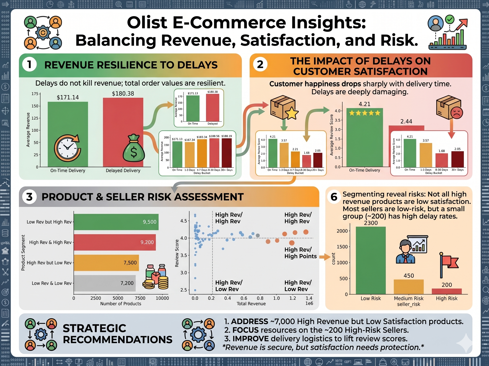

# Olist E-Commerce Analytics — A Pandas Refresher Project



A hands-on pandas project that turns the public Olist Brazilian e-commerce dataset into a small end-to-end analytics pipeline: raw CSVs → cleaned tables → fact tables → domain analyses → insight-led visualizations.

The goal is to  revisit and stretch basic pandas skills (merges, groupbys, time deltas, bucketing, melts, scoring) on a realistic dataset with a real business question — **how do delivery delays impact reviews and revenue, and which sellers and products drive risk?**

---

## The questions this project answers

1. **Do delivery delays hurt review scores?** Yes — and the drop scales with how late the order is.
2. **Do delays hurt revenue per order?** Not meaningfully — customers still pay, but they punish you in reviews.
3. **Are late deliveries concentrated in a few sellers?** Yes — a small high-risk seller group drives a disproportionate share of delays.
4. **Do high-revenue products also earn high reviews?** Not always — there's a "risky" segment that brings revenue but kills satisfaction.
5. **Which product categories depend on risky products?** Some top categories are propped up by products in the risky segment.

Each question maps directly to a chart in `results/` with a self-explanatory title.

---

## Dataset

[Olist Brazilian E-Commerce Public Dataset](https://www.kaggle.com/datasets/olistbr/brazilian-ecommerce) — ~100k orders from 2016–2018, with orders, items, products, sellers, customers, payments, reviews, and geolocation tables.

Raw CSVs should be saved under `data/archive/` (and a mirror under `include/data/archive/` for the Airflow DAG).

---

## Project structure

```
src/
├── clean_data.py                 # Standardize dtypes, dedupe, handle nulls per table
├── analytics_builder.py          # Build order fact table (orders + customers + items + products)
├── delay_impact_builder.py       # Flag delays, bucket by lateness, compute review/revenue impact
├── seller_performance_builder.py # Per-seller delay rate, revenue, risk category
├── product_analysis_builder.py   # Per-product and per-category revenue × review segmentation
└── visualization_builder.py      # Render all charts with insight-driven titles

dags/
└── analysis_pipeline.py          # Airflow DAG wiring all builders into a single pipeline

tests/                            # pytest suite covering each builder
data/                             # Raw, cleaned, and analytics CSVs
results/                          # Generated charts (.jpg)
```

Each builder is a small class with a `run()` method and clear responsibilities — read this project one builder at a time.

---

## Pipeline flow

```
clean_data → analytics_builder → delay_impact_builder ─┐
                                                       ├─→ visualization_builder
                                  seller_performance ──┤
                                  product_analysis ────┘
```

Run the whole thing locally:

```bash
pip install -r requirements.txt
cd src
python clean_data.py
python analytics_builder.py
python delay_impact_builder.py
python seller_performance_builder.py
python product_analysis_builder.py
python visualization_builder.py
```

Or, if you have Astronomer/Airflow set up, run the DAG `analysis_pipeline` in `dags/`.

---

## Pandas concepts you can refresh by reading the code

| Concept                         | Where to look                                                    |
|---------------------------------|------------------------------------------------------------------|
| Datetime coercion + validation  | `clean_data.py` → `_fix_datetime_columns`                        |
| Multi-table merging             | `analytics_builder.py` → `_build_order_facts`                    |
| Time deltas + boolean flagging  | `delay_impact_builder.py` (delivery vs. estimate)                |
| `pd.cut` bucketing              | `delay_impact_builder.py` (delay buckets)                        |
| `groupby` + aggregation         | All builders                                                     |
| Risk scoring + categorization   | `seller_performance_builder.py`                                  |
| Quadrant segmentation           | `product_analysis_builder.py` (revenue × review)                 |
| `df.melt` for plot-ready shapes | `visualization_builder.py` → `plot_seller_performance_summary`   |
| Stacked bar from wide DataFrame | `visualization_builder.py` → `plot_product_category_segments`    |

---

## Key insights (with charts)

- `results/avg_review_score_by_delay.jpg` — Review scores drop sharply when orders arrive late.
- `results/avg_review_score_by_delay_bucket.jpg` — The later the delivery, the worse the score.
- `results/avg_revenue_by_delay.jpg` — Revenue is roughly flat regardless of delay.
- `results/seller_delay_distribution.jpg` — Most sellers deliver on time; a tail of high-delay sellers stands out.
- `results/seller_risk_summary.jpg` — High-risk sellers generate revenue but degrade customer experience.
- `results/revenue_vs_reviews.jpg` — Product-level scatter of revenue vs. satisfaction with quadrant lines.
- `results/category_segment_mix.jpg` — Some top categories depend heavily on "risky" products.

---

## Running the tests

```bash
pytest
```

Tests cover the cleaning logic and each analytical builder.

---

## What's intentionally left out

- No ML — this is a pandas + analytical-storytelling project, not a modeling one.
- No interactive dashboard — charts are static `.jpg`s by design, optimized for a written write-up.
- No deep performance tuning — the dataset is small enough that clarity wins over micro-optimization.

---

## License

MIT — use the code freely for learning, teaching, or as a template for your own pandas refresher.